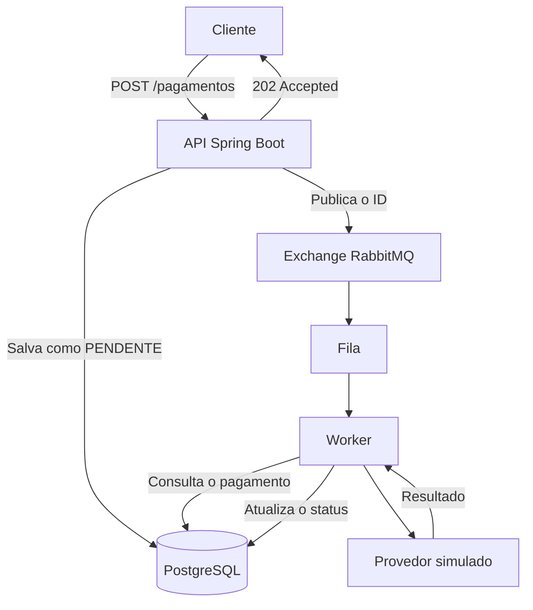

Gateway de pagamentos com RabbitMQ
Projeto de estudo em Java que simula o processamento de pagamentos com Spring Boot, RabbitMQ e PostgreSQL. O provedor é um mock: nenhuma cobrança real é feita.
A ideia foi separar o recebimento do pedido do processamento. A API registra o pagamento e retorna 202 Accepted com status PENDENTE. O processamento acontece em segundo plano, por um consumidor da fila.
A fila permite distribuir o trabalho ao longo do tempo. A capacidade de atender um pico de requisições, porém, depende da aplicação, do banco e dos consumidores — precisa ser medida com testes de carga.
Como funciona

1. O cliente envia os dados para POST /pagamentos.
2. A API salva o pagamento no PostgreSQL como PENDENTE e publica seu ID no RabbitMQ.
3. Um worker com @RabbitListener recebe a mensagem e consulta o pagamento no banco.
4. O worker chama o provedor simulado e atualiza o status para APROVADO ou RECUSADO.
   O retorno 202 Accepted indica que o pedido foi recebido. A aprovação depende do processamento posterior.
   Tecnologias
- Java 21
- Spring Boot 4.1.1
- Spring Data JPA e Hibernate
- PostgreSQL
- RabbitMQ e Spring AMQP
- Docker Compose para a infraestrutura local
  Executando localmente
  Você precisa de Java 21 e Docker com Docker Compose. Os comandos abaixo usam o Maven Wrapper incluído no projeto.
1. Suba o banco e o RabbitMQ
   docker compose up -d
   Serviço	Acesso local
   PostgreSQL	localhost:5433
   RabbitMQ (AMQP)	localhost:5672
   Painel do RabbitMQ	http://localhost:15672

Para acessar o painel local, use guest como usuário e senha.
2. Inicie a aplicação
   ./mvnw spring-boot:run
   No Windows, pelo PowerShell:
   .\mvnw.cmd spring-boot:run
   A API estará disponível em http://localhost:8080.
   Criando um pagamento
   POST /pagamentos
   Cabeçalho: Content-Type: application/json
   {
   "pagadorId": "11111111-1111-1111-1111-111111111111",
   "recebedorId": "22222222-2222-2222-2222-222222222222",
   "valor": 150.50,
   "descricao": "Pagamento de teste"
   }
   A resposta é 202 Accepted, com os dados do pagamento e o status inicial PENDENTE.
   Reentrega de mensagens
   O worker verifica o status antes de processar. Se o pagamento já saiu de PENDENTE, ele não executa a operação novamente.
   Essa verificação evita reprocessar pagamentos já finalizados, mas ainda não garante idempotência em todos os cenários. Dois consumidores podem consultar o mesmo status ao mesmo tempo. Também pode ocorrer uma falha depois da chamada ao provedor e antes da atualização no banco.
   Para uma integração real, seria necessário tratar essas situações e usar uma chave de idempotência na operação com o provedor, quando houver suporte.
   Limitações e próximos passos
- Provedor simulado: o mock usa uma taxa de aprovação de 90%.
- Sem autenticação e autorização: os endpoints ainda não têm controle de acesso.
- Sem DLQ: não há uma fila separada para analisar mensagens que falharam. O descarte ou a reentrega depende da configuração de tratamento de erros.
- Sem reconciliação: não há uma rotina para verificar pagamentos presos em PENDENTE ou PROCESSANDO.
- Consistência entre banco e fila: revisar o comportamento caso o pagamento seja salvo, mas a publicação da mensagem falhe. O padrão transactional outbox é um próximo passo possível.
- Concorrência e idempotência: reforçar a proteção contra processamento simultâneo e repetição de operações.